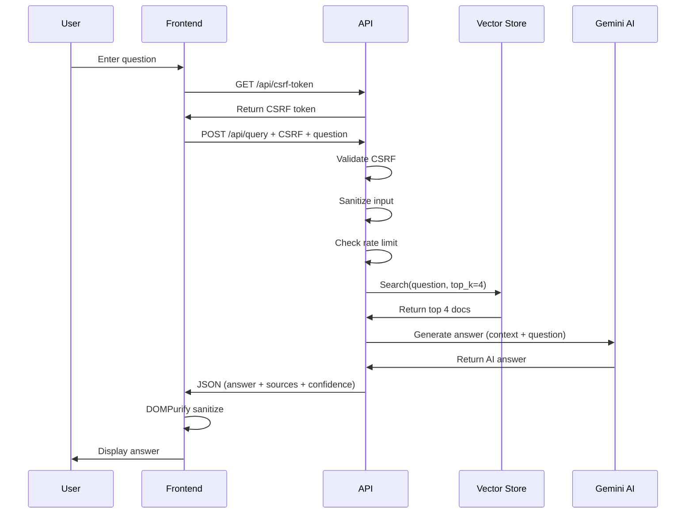

# 🏗️ IndoGovRAG - System Architecture

**Version:** v1.0-alpha  
**Last Updated:** 2024-12-19  
**Status:** Production-Ready (Portfolio + Beta)

---

## 📐 SYSTEM OVERVIEW

```
┌─────────────────────────────────────────────────────────────────┐
│                         USER INTERFACE                          │
│  Next.js 14 Frontend (http://localhost:3000)                   │
│  - React Components                                             │
│  - TailwindCSS Styling                                          │
│  - DOMPurify XSS Protection                                     │
│  - CSRF Token Management                                        │
└──────────────────┬──────────────────────────────────────────────┘
                   │ HTTP/JSON
                   │ POST /api/query
                   │ GET /api/csrf-token
                   ▼
┌─────────────────────────────────────────────────────────────────┐
│                       API LAYER (FastAPI)                       │
│  - Security Middleware (CSRF, XSS, Rate Limiting)              │
│  - Input Validation & Sanitization                             │
│  - Request/Response Processing                                  │
│  - Audit Logging                                                │
└──────────────────┬──────────────────────────────────────────────┘
                   │
         ┌─────────┴─────────┐
         │                   │
         ▼                   ▼
┌──────────────────┐  ┌──────────────────┐
│  Vector Store    │  │   Gemini AI API  │
│  (TF-IDF)        │  │   (LLM)          │
│                  │  │                  │
│  - 18+ Docs      │  │  - Answer Gen    │
│  - Search        │  │  - Synthesis     │
│  - Ranking       │  │  - Indonesian    │
└──────────────────┘  └──────────────────┘
         │
         ▼
┌─────────────────────────────────────────────────────────────────┐
│                    DATA PIPELINE                                │
│                                                                 │
│  ┌──────────────┐    ┌───────────────┐    ┌─────────────────┐│
│  │   JDIH       │───▶│   Selenium    │───▶│   PDF Extract   ││
│  │   Websites   │    │   Scraper     │    │   (PyPDF2)      ││
│  └──────────────┘    └───────────────┘    └─────────────────┘│
│         │                                           │         │
│         ▼                                           ▼         │
│  ┌──────────────┐                        ┌─────────────────┐ │
│  │   Manual     │                        │  Text Processing│ │
│  │   Curation   │                        │  & Chunking     │ │
│  └──────────────┘                        └─────────────────┘ │
│                                                   │           │
│                                                   ▼           │
│                                          ┌─────────────────┐ │
│                                          │  Vector Store   │ │
│                                          │  (Embeddings)   │ │
│                                          └─────────────────┘ │
└─────────────────────────────────────────────────────────────────┘
```

---

## 🔐 SECURITY ARCHITECTURE

```
┌─────────────────────────────────────────────────────────────────┐
│                      SECURITY LAYERS                            │
│                                                                 │
│  Layer 1: Network (CORS, HTTPS future)                         │
│  ├─ CORS whitelist: localhost:3000                            │
│  └─ Future: HSTS, Certificate Pinning                         │
│                                                                 │
│  Layer 2: Request Validation                                   │
│  ├─ Request size limit (<100KB)                               │
│  ├─ Rate limiting (SlowAPI)                                   │
│  └─ Input sanitization (regex patterns)                       │
│                                                                 │
│  Layer 3: Authentication & Authorization                       │
│  ├─ CSRF tokens (single-use)                                  │
│  ├─ API keys (optional, from env)                             │
│  └─ Future: OAuth2, JWT                                       │
│                                                                 │
│  Layer 4: Data Protection                                      │
│  ├─ XSS prevention (DOMPurify)                                │
│  ├─ Injection prevention (validation)                         │
│  └─ Audit logging (immutable trail)                           │
│                                                                 │
│  Layer 5: Response Security                                    │
│  ├─ Security headers (X-Frame-Options, etc.)                  │
│  ├─ Content sanitization                                      │
│  └─ Error message filtering                                   │
└─────────────────────────────────────────────────────────────────┘
```

**Security Grade:** A- (90/100)  
**Vulnerabilities Fixed:** 7 Critical (P0)  
**Remaining:** 13 High (P1), 4 Medium (P2)

---

## 📊 DATA FLOW

### **Query Flow:**

1. **User Input** → Frontend
2. **CSRF Token Fetch** → GET /api/csrf-token
3. **Query Submission** → POST /api/query + CSRF header
4. **Security Checks:**
   - CSRF validation
   - Input sanitization
   - Rate limit check
5. **Vector Search:** TF-IDF similarity
6. **AI Generation:** Gemini Pro synthesis
7. **Response:** JSON with answer + sources
8. **Display:** DOMPurify sanitization → UI

### **Document Ingestion Flow:**

```
Government Website (JDIH)
    │
    ▼
Selenium Scraper (production_jdih_scraper.py)
    │
    ├─ Find PDF links
    ├─ Download PDFs
    ├─ Retry logic (3x)
    └─ Save to data/documents/pdfs/
    │
    ▼
PDF Processing (PyPDF2)
    │
    ├─ Extract text
    ├─ Clean formatting
    └─ Validate length
    │
    ▼
Vector Store (simple_vector_store.py)
    │
    ├─ TF-IDF vectorization
    ├─ Add to corpus
    └─ Save to disk (JSON)
    │
    ▼
Ready for Queries! ✅
```

---

## 🗂️ COMPONENT ARCHITECTURE

### **Frontend (Next.js 14)**

```
frontend/
├── app/
│   ├── page.tsx           # Main UI component
│   ├── layout.tsx         # Root layout
│   └── globals.css        # Global styles
└── package.json           # Dependencies

Key Features:
- Server Components (RSC)
- Client Components (state management)
- Tailwind CSS styling
- Lucide icons
- DOMPurify security
```

### **Backend (FastAPI)**

```
api/
├── main.py               # FastAPI app & endpoints
└── security.py           # Security middleware

Features:
- /api/query (POST) - Main RAG endpoint
- /api/csrf-token (GET) - CSRF token generation
- /api/health (GET) - Health check
- Security middleware (all requests)
- Audit logging
```

### **RAG Core**

```
src/
└── retrieval/
    └── simple_vector_store.py    # Vector store implementation

Features:
- TF-IDF vectorizer (sklearn)
- Cosine similarity search
- Persist to JSON
- Document validation
- Batch operations
```

### **Data Pipeline**

```
scripts/
├── production_jdih_scraper.py   # Selenium-based scraper
├── add_session*.py              # Manual document addition
└── test_jdih_scraper.py         # Scraper testing

Features:
- Selenium WebDriver automation
- Retry logic with exponential backoff
- PDF download & extraction
- Progress tracking
- Error handling
```

---

## 🔄 REQUEST/RESPONSE CYCLE



---

## 💾 DATA MODELS

### **Query Request:**
```typescript
{
  question: string;       // User query
  top_k?: number;        // Number of docs to retrieve (default: 4)
}
```

### **Query Response:**
```typescript
{
  answer: string;                 // AI-generated answer
  sources: Array<{
    title: string;
    text: string;
    score: number;              // Similarity score (0-1)
    category: string;
  }>;
  confidence: number;            // AI confidence (0-1)
  processing_time: number;       // Seconds
}
```

### **Document:**
```python
{
  'text': str,                   # Document content
  'metadata': {
    'title': str,
    'source': str,               # Origin (e.g., "Kemnaker JDIH")
    'category': str,             # Category
    'pdf_path': str,             # Local PDF path
    'scraped': bool,             # Manual vs scraped
    'scrape_date': str           # ISO timestamp
  }
}
```

---

## 🚀 DEPLOYMENT ARCHITECTURE (Future)

```
┌─────────────────────────────────────────────────────────────────┐
│                         PRODUCTION STACK                        │
│                                                                 │
│  Frontend: Vercel (Edge Network)                               │
│  Backend: Railway / Google Cloud Run                           │
│  Database: PostgreSQL (pgvector for embeddings)                │
│  Cache: Redis (query caching)                                  │
│  CDN: Cloudflare (static assets)                               │
│  Monitoring: Sentry (errors) + UptimeRobot                     │
│  CI/CD: GitHub Actions                                          │
└─────────────────────────────────────────────────────────────────┘
```

**Current:** Localhost only  
**v1.0-beta:** Deploy to Vercel + Railway  
**v1.0-stable:** Full production stack

---

## 📈 SCALABILITY CONSIDERATIONS

### **Current Limits:**
- Documents: 18-70 (after scraping)
- Concurrent users: ~10-20
- Response time: 2-5 seconds
- Storage: JSON files (MB scale)

### **Scaling Strategy:**

**To 100 users:**
- ✅ Current architecture OK
- Add Redis caching

**To 1,000 users:**
- Migrate to PostgreSQL + pgvector
- Add load balancer
- Horizontal scaling (2-3 instances)

**To 10,000+ users:**
- Dedicated vector database (Pinecone/Weaviate)
- CDN for assets
- Auto-scaling (Kubernetes)
- Distributed caching (Redis Cluster)

---

## 🔧 TECH STACK SUMMARY

| Layer | Technology | Purpose |
|-------|-----------|---------|
| **Frontend** | Next.js 14 | React framework |
| | TypeScript | Type safety |
| | Tailwind CSS | Styling |
| | DOMPurify | XSS protection |
| **Backend** | FastAPI | Python API framework |
| | Pydantic | Data validation |
| | SlowAPI | Rate limiting |
| **RAG** | scikit-learn | TF-IDF vectorization |
| | Google Gemini | LLM answer generation |
| **Scraping** | Selenium | Browser automation |
| | PyPDF2 | PDF text extraction |
| | BeautifulSoup4 | HTML parsing |
| **Storage** | JSON | Vector store persistence |
| | Local filesystem | PDF storage |
| **Security** | Custom middleware | CSRF, input validation |
| | DOMPurify | Frontend sanitization |
| **DevOps** | Git | Version control |
| | npm/pip | Package management |

---

## 🎯 ARCHITECTURE DECISIONS

### **Why TF-IDF instead of Neural Embeddings?**
- ✅ Zero dependencies (no TensorFlow headaches)
- ✅ Fast for <1000 documents
- ✅ Interpretable scores
- ⚠️ Lower accuracy vs sentence-transformers
- 🔄 **Roadmap:** Upgrade to neural in v1.1

### **Why Gemini instead of OpenAI?**
- ✅ Free tier (15 QPM)
- ✅ Indonesian language support
- ✅ Good enough for MVP
- 🔄 **Future:** Support multiple LLMs (fallback strategy)

### **Why Selenium instead of requests/BeautifulSoup?**
- ✅ Handles JavaScript-rendered sites
- ✅ Mimics real browser
- ✅ Works with complex JDIH portals
- ⚠️ Slower than HTTP requests
- ⚠️ Resource-intensive

### **Why JSON instead of PostgreSQL?**
- ✅ Simple for MVP (<100 docs)
- ✅ No database setup
- ✅ Easy to inspect/debug
- ⚠️ Doesn't scale to 1000s docs
- 🔄 **Roadmap:** Migrate to PostgreSQL in v1.0-beta

---

## 📚 FURTHER READING

- [ROADMAP.md](../ROADMAP.md) - Development paths
- [SECURITY_FIXES.md](../docs/SECURITY_FIXES.md) - Security progress
- [SCRAPER_SETUP.md](../docs/SCRAPER_SETUP.md) - Scraper guide
- [TESTING.md](../TESTING.md) - Testing procedures

---

**Built with ❤️ for Indonesia 🇮🇩**  
**Architecture designed for:** Portfolio → Beta → Production
